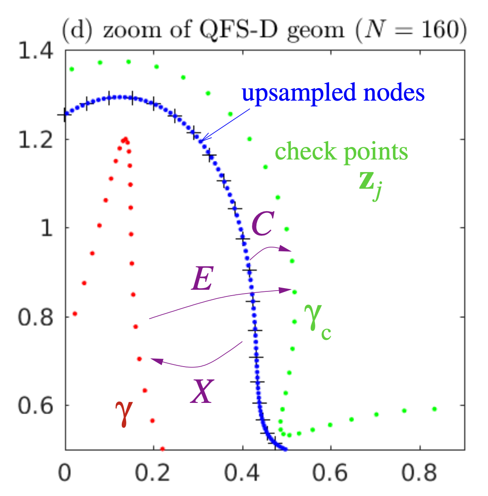
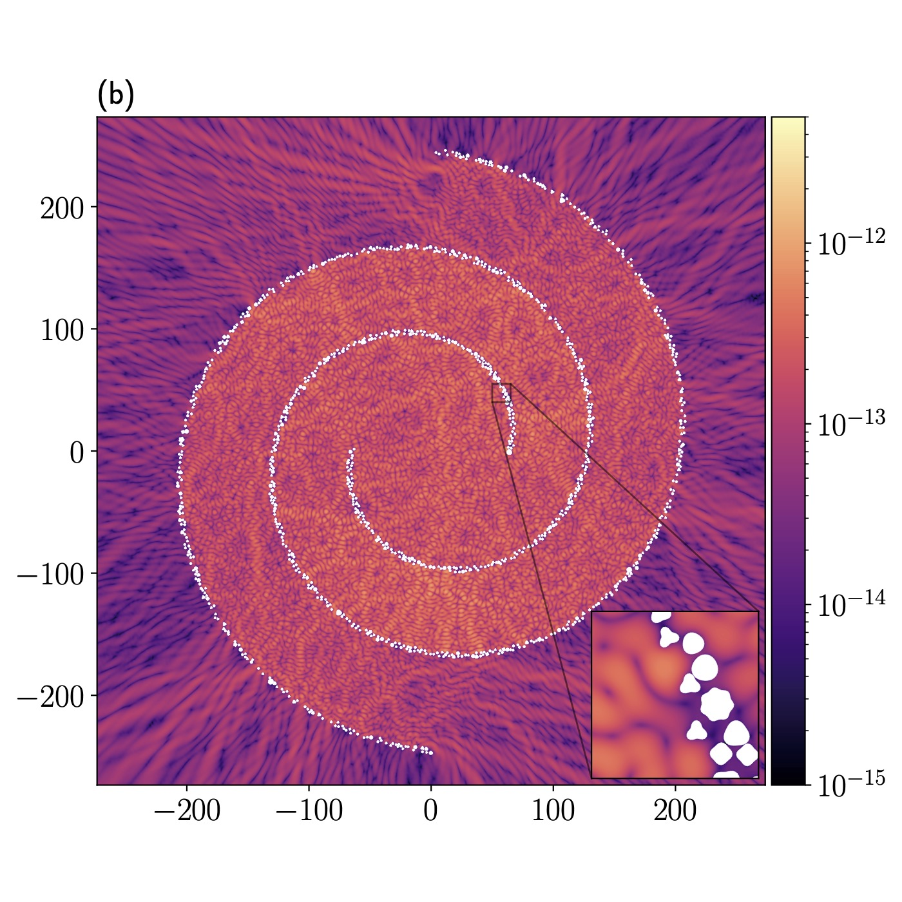

# qfs
Quadrature by fundamental solutions --- kernel independent on-surface and close evaluation of layer potentials for small to moderately sized objects. Briefly, the method works as follows (see diagram below, here described for evaluating to the exterior of a boundary): a layer potential given on the black points is upsampled to the blue points, from which naive quadrature is sufficient to obtain machine precision at the green points. An effective representation is then found at the red points by requring that it match the naive/upsampled evaluation at the green points. This effective representation can then be evaluated anywhere in the exterior (or on the boundary, giving the exterior limit in the case where the layer potential produces a jump).  See paper [here](https://arxiv.org/abs/2109.08802) for a description of the methodology.



Note that this method utilizes O(N^3) direct linear algebra in the generation of on-surface and near-surface quadratures. While typically very fast for N<1000, setup times can become slow for larger N. The method scales well for many small bodies:



This repository houses general purposes classes (QFS and QFS_Pressure) which should, in general, not be called directly as they are quite complicated. In addition, it has easy to use subclasses for Laplace, Modified Helmholtz, Helmholtz and Stokes (QFS-D supported for all, QFS-B supported for all except Helmholtz). If a user wishes to define a new kernel, I recommend that they follow one of those files as a template to define a new, easy to use subclass of the underlying QFS class. Examples are provided for each kernel.

## Requirements
For full operation, users should have installed:
1. numpy
2. scipy
3. shapely
4. numexpr
5. numba
6. pybie2d, available here
7. best performance for solving real problems will require pybie2d to have access to pyfmmlib2d (available here)

## Fallback requirements
For minimal operation, a fallback which removes the dependency on pybie2d is available. This will enable only the QFS-D method with Form backends for Laplace, Modified_Helmholtz, and Stokes problems. The Stokes example will only run if pyfmmlib2d is installed.
1. numpy
2. scipy
3. shapely

## Simple Example
Suppose you have an slp γ and a dlp σ that you'd like to evaluate to some targets on the interior of a boundary (some of which may be arbitrarily close, or even on, that boundary). We'll use the Laplace problem as an example. This is as easy as:
```python
qfs = Laplace_QFS(bdy, interior=True, slp=True, dlp=True)
ζ = qfs([γ, σ])
u_at_targ = Laplace_Layer_Apply(qfs.source, targ, charge=ζ) # naive quad!
```
Note that Laplace_QFS uses single-layer representation under the hood, so only charge needs to be included to eval the effective representation ζ.
